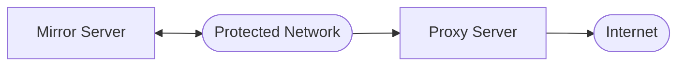

# Rust Cargo Proxy Mirror

## Overview

This tool allows access to the rust crate repository from a network without direct internet access, but with a connected server that does.



It consists of a pair of services. The proxy service sits on machine with access to both the internet and the protected network. The mirror service sits one the protected network and provides the HTTP download side of the cargo repository protocol. The mirror accepts a connection from the proxy, and while connected can request downloads of crates from the proxy when called upon by an instance of cargo running on the protected network.

The proxy is intentionally limited in functionality to minimize security concerns. It initiates a connection to the mirror service so that it does not need to accept any arbitrary connections for unknown or untrusted clients. It only supports fielding requests for packages by accepting a package name and version via a custom RPC protocol which prevent misuse. It only attempt connecting to its configured mirror server which makes it difficult to intercept. By being implemented in only safe rust and not allowing any incoming connections, its attack surface is significantly reduced.

## Usage

Cargo requires access to a git repository with an index of all available packages, it then requests via a URL embedded in the index packages from an HTTP server with a particular format of URL. Currently, the copy of the cargo package index must be kept up to date manually. It can be served easily by the `git daemon` command on the mirror server. (see its documentation  for the specifics of hosting)

```
C:\Projects\n8ware\rust\proxy-mirror\test>dir
 Volume in drive C has no label.

 Directory of C:\Projects\n8ware\rust\proxy-mirror\test

06/14/2021  07:55 PM    <DIR>          .
06/14/2021  07:55 PM    <DIR>          ..
06/14/2021  07:56 PM    <DIR>          crates.io-index.git
               0 File(s)              0 bytes
               5 Dir(s)  66,001,768,448 bytes free

C:\Projects\n8ware\rust\proxy-mirror\test>git daemon --base-path=%CD%
```

A machine on the protected network must have its cargo config setup to point at the mirror server.

Add this  `~\.cargo\config.toml` with `{mirror-server-name-or-address}` set appropriately:

```toml
[source.mirror]
registry = "git://{mirror-server-name-or-address}/crates.io-index.git"
[source.crates-io]
replace-with = "mirror"

```

The mirror service running on the protected network requires the following environmental variables to be configured:

```
set CPM_HTTP_LOCAL_END_POINT=<address and port to accept http connections on: `0.0.0.0:3000`>
set CPM_PROXY_LOCAL_END_POINT=<address and port to accept proxy connections on: `0.0.0.0:8080`>
```

Then:

```
C:\cpm> set RUST_LOG=info
C:\cpm> mirror
```


The proxy service running on the proxy machine requires the following environmental variables to be configured:

```
set CPM_MIRROR_REMOTE_END_POINT=<ip or host name and port of mirror server: e.i. `1.2.3.4:8080`>
set CPM_CRATES_IO_BASE_URL=<base URL of crates server `https://crates.io/api/v1/crates`>
```

Then:

```
C:\cpm> set RUST_LOG=info
C:\cpm> proxy
```


